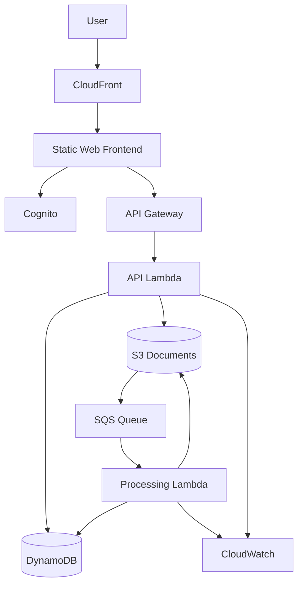

# CloudVault

> An AWS Solutions Architect Associate learning project built incrementally as I progress through the SAA course.

## Project goal

CloudVault is a secure, scalable, and cost-conscious document platform. I am using it to turn AWS concepts from the Solutions Architect Associate course into hands-on architecture decisions and implementation work.

**Learning loop:** Learn → Build → Break → Troubleshoot → Document → Improve

## Current status

### Phase 0 — IAM & Account Foundations

**Status: ✅ Complete**

- [x] Create the GitHub repository
- [x] Configure a $10/month AWS Budget
- [x] Secure the AWS root user and everyday access
- [x] Configure AWS CLI with temporary credentials
- [x] Verify identity with `aws sts get-caller-identity`
- [x] Create `CloudVaultEC2Role`
- [x] Validate its EC2 trust relationship
- [x] Document Phase 0 lessons

### Phase 1 — Amazon S3 / Object Storage

**Status: ✅ Complete**

- [x] Create the CloudVault document bucket
- [x] Use `ap-southeast-1`
- [x] Configure `BucketOwnerEnforced`
- [x] Enable all S3 Block Public Access controls
- [x] Enable bucket versioning
- [x] Configure SSE-S3 (`AES256`)
- [x] Add CloudVault resource tags
- [x] Upload and download objects through the AWS CLI
- [x] Test object versioning
- [x] Test delete markers and recovery
- [x] Test restoring an older object version
- [x] Finalize the least-privilege S3 IAM policy
- [x] Validate the policy with IAM Access Analyzer
- [x] Create `CloudVaultS3DocumentAccess`
- [x] Attach the policy to `CloudVaultEC2Role`
- [x] Validate allowed and denied actions with the IAM policy simulator
- [x] Configure S3 lifecycle management
- [x] Configure 30-day expiration for noncurrent object versions
- [x] Review S3 storage classes
- [x] Test presigned URLs for temporary private access
- [x] Test direct upload with a presigned PUT URL
- [x] Test S3 user-defined object metadata
- [x] Validate metadata behavior with object versioning
- [x] Review CloudWatch S3 storage metrics
- [x] Review CloudTrail management-event visibility
- [x] Validate final bucket security configuration
- [x] Validate final IAM role and policy configuration
- [x] Review Phase 1 storage usage and AWS cost
- [x] Complete Phase 1 validation and documentation

## Current implementation

CloudVault currently has a private S3 document-storage foundation with:

- S3 Block Public Access fully enabled
- `BucketOwnerEnforced` object ownership
- SSE-S3 encryption
- object versioning and recovery
- 30-day expiration of noncurrent versions
- least-privilege IAM access through `CloudVaultEC2Role`
- presigned GET and PUT workflows
- baseline CloudWatch and CloudTrail observability

The EC2 runtime integration is intentionally deferred until the compute phase.

## Budget guardrail

**Target steady-state cost:** less than **$10 USD/month**

The project will prefer serverless and pay-per-use services for the final architecture. More expensive always-on resources such as NAT Gateways, load balancers, EC2 fleets, and RDS deployments will be treated as temporary learning labs unless they can be justified within the budget.

Phase 1 cost validation confirmed that the S3 learning workload remained effectively at $0 at its current lab scale and comfortably within the project budget. Current-period Cost Explorer figures are estimates until billing data is finalized.

## Planned architecture



The target architecture will evolve as each AWS service is covered in the course. A separate current-state diagram records only what has actually been implemented so far.

## Roadmap

| Phase | Focus | AWS concepts/services |
|---|---|---|
| 0 | Security foundation | IAM, MFA, roles, policies, AWS CLI, STS |
| 1 | Object storage | S3, encryption, versioning, metadata, lifecycle, storage classes, presigned URLs, monitoring |
| 2 | Compute | EC2, EBS, user data, instance roles |
| 3 | Networking & HA | VPC, subnets, routing, security groups, ELB, Auto Scaling |
| 4 | Databases | RDS, backups, Multi-AZ concepts, DynamoDB |
| 5 | Serverless API | Lambda, API Gateway, DynamoDB |
| 6 | Asynchronous processing | S3 events, SQS, Lambda, DLQ |
| 7 | Delivery & observability | CloudFront, Cognito, CloudWatch |
| 8 | Final review | Well-Architected tradeoffs, cost optimization, documentation |

## Repository structure

```text
aws-cloudvault/
├── README.md
├── PHASE-0-SETUP.md
├── budget/
│   ├── budget.json
│   └── notifications.json
├── docs/
│   ├── architecture/
│   │   ├── cloudvault-architecture.mmd
│   │   └── cloudvault-current-state.mmd
│   ├── learning-log/
│   │   ├── phase-0-iam.md
│   │   └── phase-1-s3.md
│   └── reference/
│       └── CloudVault_Command_Notes.xlsx
├── iam/
│   ├── assume-role-policy-ec2.json
│   └── policies/
│       └── cloudvault-s3-document-access.json
├── s3/
│   └── config/
│       ├── bucket_encryption.json
│       ├── bucket-tags.json
│       └── lifecycle.json
├── scripts/
│   └── presigned_put.py
├── backend/
├── frontend/
└── infrastructure/
```

## Security principles

- Do not use the AWS root user for everyday work.
- Protect root and other privileged access with MFA.
- Prefer temporary credentials over long-lived access keys.
- Grant least privilege and scope resource access wherever possible.
- Keep IAM trust relationships separate from workload permissions and validate both independently.
- Keep S3 document storage private by default.
- Use short-lived presigned URLs when temporary access to private S3 objects is required.
- Treat active presigned URLs as sensitive and never commit them to source control.
- Never commit secrets, access keys, tokens, `.env` files, or AWS credential files.
- Avoid publishing unnecessary account IDs, account-specific ARNs, role IDs, canonical owner IDs, and object version IDs.

## Cost principles

- Create a monthly AWS Budget before deploying project resources.
- Tag project resources where practical.
- Shut down or delete lab resources after use.
- Review Billing/Cost Explorer regularly.
- Keep CloudWatch log retention deliberate rather than unlimited by default.
- Use lifecycle management where it improves long-term storage hygiene without adding unnecessary complexity.
- Enable additional monitoring or audit features when their operational or security value justifies their cost and complexity.

## Identity verification

Before performing project operations, verify the active AWS identity:

```powershell
aws sts get-caller-identity --profile cloudvault
```

Expected shape:

```json
{
  "UserId": "...",
  "Account": "123456789012",
  "Arn": "arn:aws:..."
}
```

Do not publish your AWS account ID or credentials in screenshots.

## Disclaimer

This is a learning project. The architecture will intentionally change as I explore AWS design tradeoffs and apply new services from the SAA curriculum.
