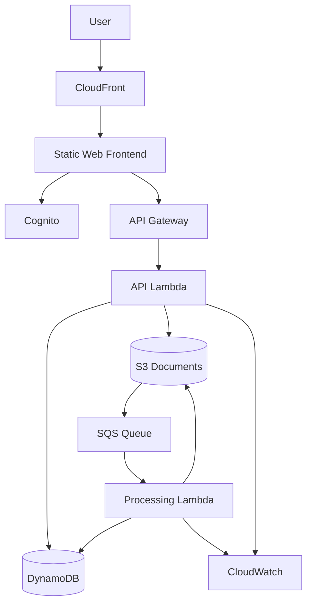

# CloudVault

> An AWS Solutions Architect Associate learning project built incrementally as I progress through the SAA course.

## Project goal

CloudVault is a secure, scalable, and cost-conscious document platform. I am using it to turn AWS concepts from the Solutions Architect Associate course into hands-on architecture decisions and implementation work.

**Learning loop:** Learn → Build → Break → Troubleshoot → Document → Improve

## Current status

**Phase 0 — IAM & account foundations**

- [ ] Create the GitHub repository
- [ ] Configure a $10/month AWS Budget
- [ ] Secure the AWS root user and everyday access
- [ ] Configure AWS CLI with temporary credentials
- [ ] Verify identity with `aws sts get-caller-identity`
- [ ] Create the first CloudVault IAM policy and role
- [ ] Document Phase 0 lessons
- [ ] Move to the next SAA section

## Budget guardrail

**Target steady-state cost:** less than **$10 USD/month**

The project will prefer serverless and pay-per-use services for the final architecture. More expensive always-on resources such as NAT Gateways, load balancers, EC2 fleets, and RDS deployments will be treated as temporary learning labs unless they can be justified within the budget.

## Planned architecture



The architecture will evolve as each AWS service is covered in the course.

## Roadmap

| Phase | Focus | AWS concepts/services |
|---|---|---|
| 0 | Security foundation | IAM, MFA, roles, policies, AWS CLI, STS |
| 1 | Object storage | S3, encryption, versioning, lifecycle |
| 2 | Compute | EC2, EBS, user data, instance roles |
| 3 | Networking & HA | VPC, subnets, routing, security groups, ELB, Auto Scaling |
| 4 | Databases | RDS, backups, Multi-AZ concepts, DynamoDB |
| 5 | Serverless API | Lambda, API Gateway, DynamoDB |
| 6 | Asynchronous processing | S3 events, SQS, Lambda, DLQ |
| 7 | Delivery & observability | CloudFront, Cognito, CloudWatch |
| 8 | Final review | Well-Architected tradeoffs, cost optimization, documentation |

## Repository structure

```text
aws-cloudvault/
├── README.md
├── budget/
│   ├── budget.json
│   └── notifications.json
├── docs/
│   ├── architecture/
│   │   └── cloudvault-architecture.mmd
│   └── learning-log/
│       └── phase-0-iam.md
├── iam/
│   ├── assume-role-policy-ec2.json
│   └── policies/
│       └── cloudvault-s3-document-access.json
├── backend/
├── frontend/
└── infrastructure/
```

## Security principles

- Do not use the AWS root user for everyday work.
- Protect root and other privileged access with MFA.
- Prefer temporary credentials over long-lived access keys.
- Grant least privilege and scope resource access wherever possible.
- Never commit secrets, access keys, tokens, `.env` files, or AWS credential files.

## Cost principles

- Create a monthly AWS Budget before deploying project resources.
- Tag project resources where practical.
- Shut down or delete lab resources after use.
- Review Billing/Cost Explorer regularly.
- Keep CloudWatch log retention deliberate rather than unlimited by default.

## Phase 0 verification

After configuring the AWS CLI, verify the active identity:

```powershell
aws sts get-caller-identity --profile cloudvault
```

Expected shape:

```json
{
  "UserId": "...",
  "Account": "123456789012",
  "Arn": "arn:aws:..."
}
```

Do not publish your AWS account ID or credentials in screenshots.

## Disclaimer

This is a learning project. The architecture will intentionally change as I explore AWS design tradeoffs and apply new services from the SAA curriculum.
